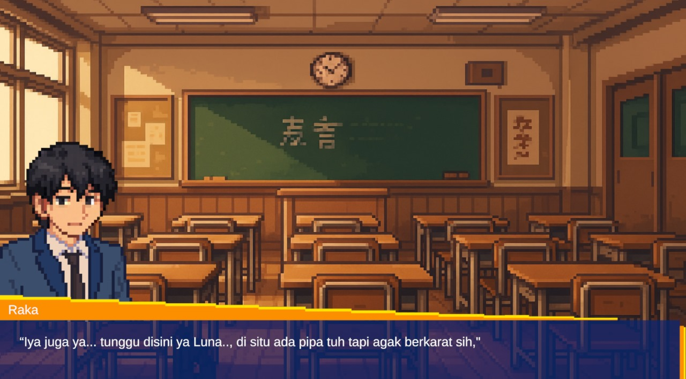

# The Everlasting Love

A Ren'Py visual novel project. The Ren'Py files live at the repository root so the project opens cleanly in Ren'Py and looks tidy on GitHub.

## Project Overview

- Story: A romantic fantasy about a protagonist pulled into a hidden world where love tests fate.
- Genre: Fantasy romance visual novel.
- Credits: Written and developed by the project team.

## Game Preview



## Structure

```
README.md
docs/
  README.md
  dev-notes.md
  screenshots/
    gamepreview.jpeg
characters.rpy
gui.rpy
options.rpy
screens.rpy
script.rpy
script.txt
bgm/
images/
  bg/
  cards/
  characters/
gui/
cache/
saves/
tl/
logs/
  errors.txt
  log.txt
  traceback.txt
```

## Notes

- Keep Ren'Py source files at the repository root so the engine can discover them.
- Large binary assets (audio/images) live under `bgm/` and `images/`.
- Runtime logs are stored in `logs/`.

## How to Run

1. Install Ren'Py from https://www.renpy.org/
2. Open Ren'Py and add this repository folder as a project.
3. Click "Launch" or "Build Distributions" from the Ren'Py launcher.